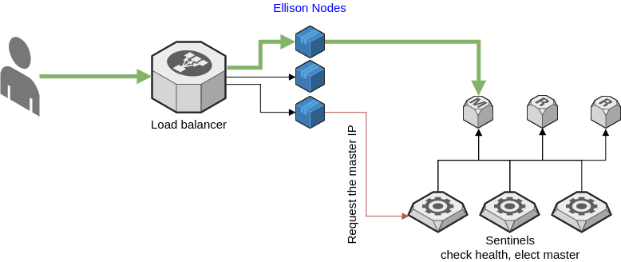

# Redis-Ellison

Ellison, Master of sentinels for client that cannot use them.

Redis provides sentinels to elect a leader (master) that is able to write data when a master falls. That is very impressive and allows Redis High Availability. But sometimes, clients (frameworks, libraries...) are not able to use sentinels. Actually, the client must know if sentinels exists and should make a request to get master address to write data.

Redis-Ellison is a proxy that will interact with sentinels and master to send and get data from the master (as this time, it cannot make distinction between get and set), so that clients can connect Redis Ellison as if it was the master, and ellison will make data routing.



Ellison is scallable, so you can use it in a PaaS as Openshift/Kubernetes and scale up. The "service" will load-balance on each Redis-Ellison server.


NOTE: At this time, you need "redis-cli" command installed on your server to be able to contact sentinels. That should change in later revisions.


# Installation

At this time, you should use "`go get`" command, but there will be releases with binaries and Docker images very soon.

```
go get -u github.com/metal3d/redis-ellison
```

# Usage

```
Usage of ellison:
  -cluster string
    	redis cluster name (default "mymaster")
  -redis-command string
    	redis command to connect to sentinel, it can also be "docker exec sentinel1 redis-cli" for example (default "redis-cli")
  -sentinel-host string
    	sentinel host or ip (default "127.0.0.1")
  -sentinel-port string
    	sentinel port to connect (default "26379")
```

Note: each flag can be overriden by an environment variable that respect the flag.:

- `CLUSTER`
- `REDIS_COMMAND`
- `SENTINEL_HOST`
- `SENTINEL_PORT`

So that, it's simpler to inject configuration in a Docker container.

# In OpenShift/Kubernetes

Sentinel host/port should be set to the service managing sentinels. So that if a sentinel is lost, the route will be set to another sentinel.


